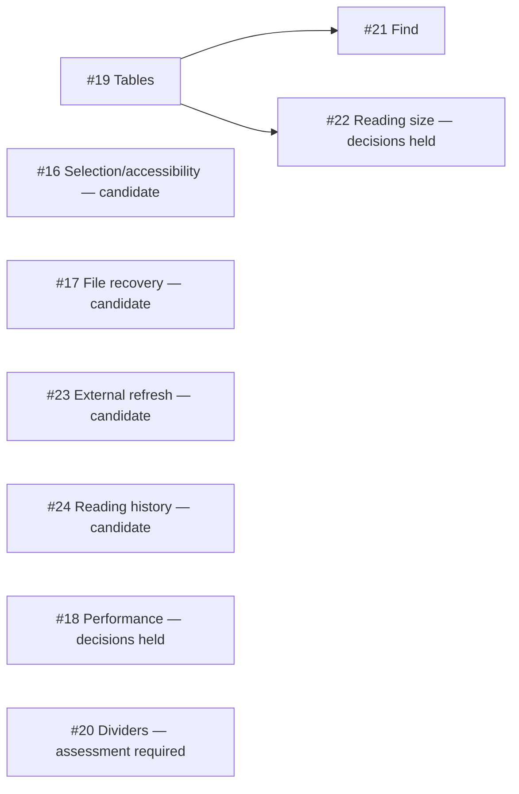

# M1-DAG-001 — adopted remaining-story execution plan

Status: **Adopted for scheduling; story acceptance and unresolved decisions are not implied.** The user authorized dependency-DAG parallel planning/implementation after #15. That checkpoint is satisfied: [PR #54](https://github.com/redrossa/neomd/pull/54) merged as `53a8c243b8359bacebee5887f4d8b2f6d200fe0c`, the exact source base for this plan. #15 is closed; native criteria remain unverified. [Milestone 1](https://github.com/redrossa/neomd/milestone/1) remains open and user-owned for business acceptance.

This revision supersedes historical sequential scheduling and stale next/paused statements, not story criteria. GitHub issue statements and approved amendments remain the contract. Unresolved product choices remain draft.

## Dispatch graph

| Stories | Initial state | Reason / next gate |
| --- | --- | --- |
| #16, #17, #19, #23, #24 | Independent final-triage candidates | Merged foundations exist; none is yet triage-accepted |
| #18 | Decision hold | Baseline Mac, minimum macOS, performance target and deferred-hang applicability |
| #20 | Existing-implementation assessment | Rules already parse/render; assess residual requirements, then ask user for disposition if already implemented |
| #21 | Wait for #19 | Search explicitly includes structured table cells |
| #22 | Wait for #19 and decisions | Table usability, persistence default and larger-size hang overlap |
| #14 | Deferred/open | Explicitly excluded; no generated-mention prerequisite |
| #36, #38 | Deferred defect context | Neither repair nor broader waiver is authorized |

These are the only **outstanding hard semantic edges**. The #15-before-#16–24 checkpoint is a separate satisfied user-priority constraint. Numbering is a tie-breaker, not a chain. #19 uses the already-merged internal `ReaderTheme(scale:)` foundation; it need not await #22 public commands. #23 refresh and #24 reopen history do not inherently depend on each other's services.

Initial capacity: **three concurrent story agents**, with #16/#17/#19 triage dispatched first and #23/#24 taking freed slots. Planning and coding may overlap within that capacity. One Xcode invocation and one merge at a time on the shared host; these resource limits do not impose whole-story or whole-wave barriers. Release #21 final triage immediately after #19's merge/completion records, regardless of unrelated work. Preliminary successor planning is PROVISIONAL until refreshed against merged prerequisites.

## Evidence and boundaries

The orchestrator inspected all 32 milestone issues (31 stories plus #38), external #36, complete paginated comments, relevant actual source/tests and existing branches/PRs. It verified 21 completed story merges as ancestors of the source base, not merely closed issue status. No open canonical PR or #16–24 story branch existed at adoption.

- **#16:** per-leaf native selection and traversal exist in `MarkdownLinkedImageText.swift` and `DocumentReaderView.swift`; code/metadata retain other selection paths. List markers are AX-hidden in `MarkdownContainerView.swift`. Triage must assess multi-leaf copying and semantic accessibility, retaining #48 quiet enclosing-focus policy and separate text/link-action stops. Broader selection architecture requires a concrete approved plan, not an assumed criterion waiver.
- **#17:** `MarkdownTextDecoder.swift` already supports UTF-8/BOM/inference/Latin-1 fallback. `DocumentOpeningCoordinator.swift` stages before commit but loses error-specific recovery information. Improve only residual native error/recovery gaps; do not silently reject existing supported encodings or rewrite the document shell.
- **#18:** detached parsing/async images are foundations, not first-visible-content or responsiveness evidence. Regular reads accumulate bytes, cmark parsing has a correctness-required global lock, and native leaf layout can be synchronous. Benchmark choices remain unresolved; #36/#38 equivalence and applicability are not established.
- **#19:** `CMarkBlockAdapter.swift` currently flattens GFM cells to paragraphs; `CMarkParityTests.swift` reflects that. Preserve row/header/column/alignment and attributed cell payloads in flat ownership, with local overflow and table-specific AX associations. YAML's `MarkdownMetadataTable.swift` is not general table support. Do not introduce recursive block ownership.
- **#20:** the adapter emits empty thematic-break nodes and `MarkdownBlockView.swift` draws adaptive padded dividers. Focused context regressions may be missing. Preserve cmark list/setext distinctions and #15 leading-YAML precedence. Do not duplicate working rendering or silently close the story.
- **#21:** document-wide visible-text search is absent. A focused `NSTextView` finder or raw source search misses lazy leaves, hidden comments, code and tables. Image attachments/fallbacks and metadata labels/recovery explanations require deliberate display-range mapping. Refresh triage against #19's actual cell/address representation.
- **#22:** internal scale exists, but public commands/preferences and explicit size-change capture/restore do not. Persistence remains proposed. #38's #13 deferral does not automatically waive #22 table/size/position criteria.
- **#23:** `ReadOnlyMarkdownNSDocument.swift` has no reader refresh publication. Existing same-URL open fast paths and immutable host installation are unsuitable as a refresh mechanism. Triage must specify settled/atomic-write observation, coalescing, latest-generation publication, per-viewer remapping and failure recovery.
- **#24:** native recents/clear already exist in `NativeReaderMenus.swift`; persistent locators do not. Per-render integer IDs are not persisted identity. Specify bounded private history, multiple-reader last-position policy, explicit-fragment precedence and changed/missing-file fallback. No folder bookmarks or automatic reopen-all-windows scope.

## Holds requiring user resolution

1. **#18:** agree baseline Mac, minimum macOS and measured target/boundary. Recommendation submitted: this development Mac, retain macOS 26.2, first readable content within one second for 1 MB excluding remote downloads. This is a question, not approval; parser timing cannot substitute for native readiness.
2. **#22:** confirm remembering reading size across documents/relaunch.
3. **#18/#22:** agree whether applicable #36/#38 hangs require separately authorized repairs or explicit extended deferrals. Preserve existing failures and unchecked criteria. Neither answer is assumed.
4. **#20:** after explicit triage assessment, obtain user disposition if already implemented; evidence/docs/regression-only work is a possible recommendation, not automatic authority.

Other candidates may proceed while these holds remain. New concrete dependencies or required product changes pause affected work and revise the graph; unrelated components continue.

## Integration ownership and artifact safety

- #19 owns table schema/surface and exhaustive-switch changes. #16 owns existing selection/AX semantics. Lease only overlapping native range/update/AX methods, not entire stories.
- #23/#24 may develop independent services concurrently, but must agree narrow copied-snapshot/content-locator/fraction and cancellation/fragment boundaries during triage. Lease overlapping reader capture/restore, read-session commit and window-install methods to one worker at a time; #23 has the first contended slot by number. Do not depend on unmerged sibling code. A genuinely necessary shared predecessor requires a graph amendment, not a hidden dependency disguised as a lease.
- Each worker has its own exact-base branch/worktree, DerivedData, results and logs. Preserve unrelated local edits and historical worktrees; no automatic stash/reset/discard.
- Triage owns inert fixtures and final-testing documentation in unique staging. Supply destination paths and base/artifact hashes, with per-story fixture directories and validation documents. Shared catalogs use uniquely headed entry patches, not stale full-file replacements. Reconcile/re-hash changed catalog bases before installation; retain every historical entry and defect record.

## Current execution policy

This section overrides broader historical validation/workflow instructions.

- Orchestrator: `openai-codex/gpt-6-astra`, high, planning only. Triage: same model/high, source/documentation research only; no prototypes, builds or executable tests. Worker: same model/low, smallest solution satisfying all approved criteria. Verify effective runtime at launch; stop on mismatch/unverifiable runtime rather than silently substituting. No role may delegate its assignment to another model.
- The coordinator adopts/revises plans and dispatches ready work. Orchestrator readiness is not final ACCEPTED triage. Every worker requires criterion-specific accepted triage on an exact main SHA, concrete scope, artifact manifest and inspected non-interaction test allowlist.
- **No reviewer stage**, including one recreated under another name. Workers run Debug build and relevant **non-interaction units only**. Broad `NeoMDTests` is not an allowlist: some methods host windows or synthesize events. No UI/E2E/manual scripted flows, native event/host substitutes, clipboard mutation, appearance changes or AX actions. Preserve tests and describe their future recipes; native/visual/AX coverage is DEFERRED/UNRUN, not passed. Known defects and failed permitted gates still block.
- Workers commit/push only story scope and supplied triage artifacts; PRs use `Refs #number` with exact tested head, commands, nonzero test counts, failures/skips and limitations. Workers never merge/close issues.
- Coordinator integrates using worker exact-head evidence without duplicate review/testing. Serialize merges, verify scope/head/required checks, never bypass protection. When main changes, the worker updates/reconciles and reruns allowed gates on the resulting head before integration.
- Mark original issue checkboxes only when the full criterion has actual supporting evidence. Record reduced implementation acceptance separately from unverified native behavior. Confirm merge, acceptance/completion comment and closure before satisfying dependency edges; reconcile partial synchronization before advancing dependents.
- Completing implementations is not milestone acceptance. User-owned combined native testing and all explicit deferrals remain outstanding; do not close the milestone without confirmation.

## Planning validation provenance

The staged complete graph passed mechanical checks: **33 unique nodes, 31 typed edges (22 semantic plus nine checkpoint-priority), full coverage, valid endpoints, acyclic topological order, 21 merge ancestors, 113 recorded source/doc hashes**, and recomputed candidate readiness. Only two outstanding semantic edges remain. No app tests/builds/interactions were run for planning.

Original staged artifact SHA-256 values identify the detailed audit without committing machine-specific inventory or temporary paths:

- DAG: `9c17ba7ee450e8a5e32e1cc821f7858011c11ac68aab56470cdabef09a305c43`
- Detailed plan: `0a85b83273df7973d7c90e2eaddca0286bf072ab2493c67931e358af8a01e849`
- Handoff: `6fedd4af3e68d45771bed5acc93307d3b3c0ab259fc09808aa4ccaf89b1e6a49`

This checked-in document is the portable adopted scheduling revision; historical source-base evidence is not a claim that later heads have been inspected or validated.
